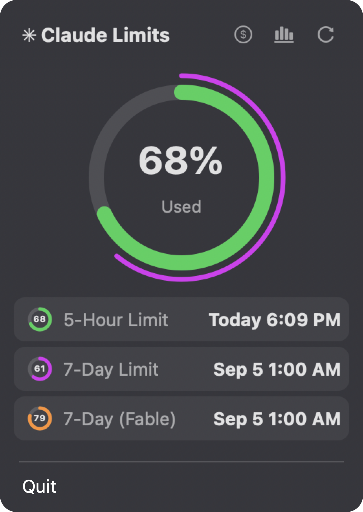

# claude-limits-bar

[](https://pypi.org/project/claude-limits-bar/)
[](LICENSE)

**Claude Code limits and their reset times, always visible in the macOS menu bar.**

If you keep hitting *"Too many requests, please try again later"*, this shows you exactly how close you are to the limit and when it resets — before Claude Code cuts you off.

## What it looks like

In the menu bar: the session (5-hour) limit in green and the 7-day limit in purple, percent used inside each ring, plus the countdown until the session limit resets.


Click it for the full picture — a large donut for the session limit (7-day limit as the thin outer arc) and one row per limit with its reset time:



- Rings turn **orange** at 80% (or when Anthropic reports elevated severity) and **red with `!`** at 100%. The session limit is the one that usually triggers "Too many requests".
- Header buttons: **$** support the developer · **bar chart** open your usage stats on claude.ai · **↻** refresh now (the gauges spin while fetching). Hover a button to see its hint.
- Data refreshes every minute, and the app checks once a day for a newer version — an **Update available** item appears in the menu when there is one.

## Install

Requires macOS 11+. Pick whichever tool you already use:

| Method | Install | Update |
|---|---|---|
| **Homebrew** | `brew install tilbertbalaban/tap/claude-limits-bar` | `brew upgrade claude-limits-bar` |
| **uv** | `uv tool install claude-limits-bar` | `uv tool upgrade claude-limits-bar` |
| **pipx** | `pipx install claude-limits-bar` | `pipx upgrade claude-limits-bar` |
| **pip** | `pip install claude-limits-bar` | `pip install -U claude-limits-bar` |
| **From source** | `git clone https://github.com/TilbertBalaban/claude-limits-bar && cd claude-limits-bar && uv tool install .` | `git pull && uv tool install . --reinstall` |

uv, pipx and pip need Python 3.9+ on your Mac; Homebrew brings its own.

Then:

```
claude-limits-bar                # run the menu bar app
claude-limits-bar autostart on   # start automatically at login (LaunchAgent)
claude-limits-bar autostart off  # remove the login item
claude-limits-bar status         # print current limits to the terminal
```

After updating, quit the app from its menu and start it again (or log out and back in if you use `autostart on`).

## How it works

Claude Code stores its OAuth token in the macOS Keychain (service `Claude Code-credentials`). This app reads that token and polls the same official endpoint the Claude apps use (`api.anthropic.com/api/oauth/usage`) once a minute. The token is sent **only** to `api.anthropic.com` — nowhere else, nothing is logged. The last successful response is cached in `~/Library/Caches/claude-limits-bar/` so the numbers show immediately after a restart.

Works on Pro and Max plans. Requires being signed in to Claude Code (`claude` → `/login`).

## Support

If this app saves you from surprise rate limits, you can support development via the `$` button in the app or at [base.monobank.ua/tilbertbalaban](https://base.monobank.ua/tilbertbalaban).

## Development

```
git clone https://github.com/TilbertBalaban/claude-limits-bar
cd claude-limits-bar
python3 -m unittest discover -s tests -v
python3 -m claude_limits_bar.cli status
```

The data layer ([claude_limits_bar/limits.py](claude_limits_bar/limits.py)) is stdlib-only and fully unit-tested; only the menu bar shell ([claude_limits_bar/menubar.py](claude_limits_bar/menubar.py)) depends on PyObjC (AppKit).

## Troubleshooting

- **`✳ ?` in the menu bar** — open the menu for the reason: no credentials (sign in to Claude Code), an expired token (use Claude Code once — it refreshes the token itself), or no network.
- **"Usage API rate-limited"** — Anthropic's limits endpoint has its own rate limit. The app keeps showing the last data and backs off for a few minutes; if it has no data yet it retries every minute.
- **`Too many requests` still happens at <100%** — the API reports utilization rounded to whole percent and with a small delay; treat the orange ring as "wrap up what you're doing".
